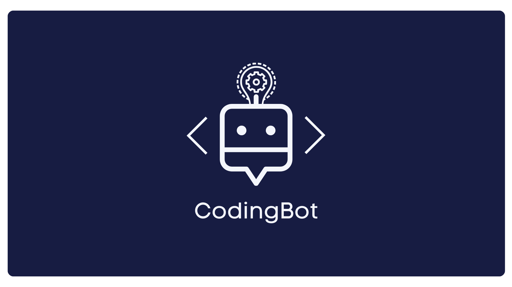

# CodingBot



CodingBot is a Discord bot designed to ask programming questions and keep track of users scores. It supports multiple commands to interact with users and features a leaderboard system to track top performers.

## Features

- Ask random programming questions
- Track users scores
- Display a leaderboard
- Show available commands

## Getting Started

### Prerequisites

- Python 3.6 or higher
- `discord.py` library
- `asyncio` library

### Installation

1. Clone the repository:
    ```sh
    git clone https://github.com/yourusername/codingbot_dis.git
    cd codingbot_dis
    ```

2. Create a virtual environment and activate it (optional but recommended):
    ```sh
    python -m venv venv
    source venv/bin/activate  # On Windows use `venv\Scripts\activate`
    ```

3. Install the required packages:
    ```sh
    pip install -r requirements.txt
    ```

### Configuration

1. Create a `questions.json` file in the root directory of the project and add your questions in JSON format:
    ```json
    [
        {
            "question": "What is the output of the following C program? ```\n#include <stdio.h>\nint main()\n{\n    int arr[] = {1, 2, 3};\n    int *p = arr;\n    p += 2;\n    printf(\"%d\", *p);\n    return 0;\n}```",
            "answers": ["1", "2", "3", "Garbage value"],
            "correct_answer": 2
        },
        {
            "question": "What is the output of the following C program? ```\n#include <stdio.h>\nint main()\n{\n    int i = 0, j = 0;\n    while(i < 10 && j++ < 5)\n    {\n        i++;\n    }\n    printf(\"%d %d\", i, j);\n    return 0;\n}```",
            "answers": ["5 5", "10 10", "5 6", "10 6"],
            "correct_answer": 2
        }
    ]
    ```

2. Create a `scores.json` file in the root directory of the project (if you want to keep track of scores from the beginning):
    ```json
    {}
    ```

3. Replace `TOKEN` with your actual Discord bot token in the `CodingBot.py` file.

### Usage

Run the bot:
```sh
python CodingBot.py
